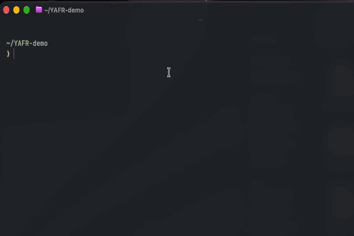
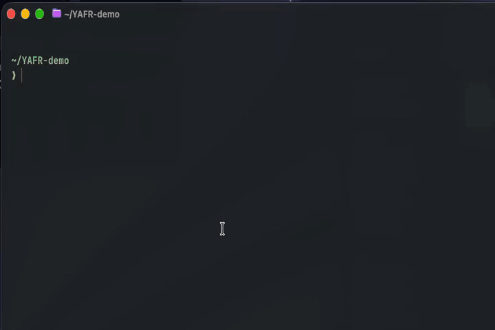
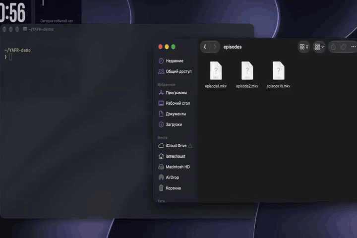

<p align="center">
  <a href="assets/banner.mp4">
    
  </a>
</p>

# YAFR

**Порядок в файлах — из терминала.**

YAFR (*Yet Another File Renamer*) сортирует файлы по расширениям и переименовывает их по шаблону. Сначала показывает план, а с `--apply` выполняет изменения.

[](pyproject.toml)
[](LICENSE)

[Установка](#установка) · [Примеры](#примеры) · [Конфигурация](#конфигурация) · [Ограничения](#ограничения) · [Разработка](#разработка)

- **Сортировка:** 29 категорий для медиа, документов, кода, данных и других файлов.
- **Переименование:** `001.jpg`, `002.jpg` или `S01E01.mkv`, `S01E02.mkv`.
- **Выбор файлов:** фильтр расширений, вложенные каталоги и скрытые файлы.
- **Предпросмотр:** проверка конфликтов до выполнения, без перезаписи существующих файлов.
- **Настройки:** TOML-конфигурация и переопределения через CLI.

Проект готовится к первому релизу. Файловые операции проверены на macOS; Linux и Windows пока требуют отдельной проверки.

## Установка

Нужны **Python 3.12+**, Git и [uv](https://docs.astral.sh/uv/getting-started/installation/). Установка из исходников в отдельное окружение:

```bash
git clone https://github.com/Zhuravlev3906/YAFR.git
cd YAFR
uv tool install .
yafr --help
```

После установки `yafr` можно запускать из любого каталога. Если команда не найдена, выполните `uv tool update-shell` и перезапустите терминал.

Для работы с кодом используйте [окружение разработчика](#разработка).

## Примеры

В примерах `./downloads`, `./photos` и `./episodes` — существующие каталоги с вашими файлами. Команды без `--apply` только показывают план.

Демонстрации ниже повторяются автоматически. Нажмите на анимацию, чтобы открыть исходное видео.

### Сортировка по расширениям

Посмотрите, куда будут перемещены файлы, затем примените изменения:

```bash
yafr sort ./downloads
yafr sort ./downloads --apply
```

При стандартных настройках:

```text
downloads/                   downloads/
├── photo.jpg                ├── images/photo.jpg
├── clip.mp4       →         ├── videos/clip.mp4
├── notes.txt                ├── documents/notes.txt
└── backup.tar.gz            └── archives/backup.tar.gz
```

[](assets/sort.mp4)

Чтобы собрать файлы из вложенных каталогов в отдельной папке:

```bash
yafr sort ./downloads --recursive --output ./sorted
```

Сортировка перемещает файлы, а не копирует их. Неизвестные расширения по умолчанию остаются на месте; каталог для них можно задать через `sort.fallback` в конфигурации.

### Переименование по шаблону

Пронумеруйте изображения, сохранив расширения:

```bash
yafr rename ./photos --ext jpg --ext png --pattern '{n:03d}'
yafr rename ./photos --ext jpg --ext png --pattern '{n:03d}' --apply
```

```text
photo2.jpg    →  001.jpg
photo10.jpg   →  002.jpg
photo11.png   →  003.png
```

[](assets/rename.mp4)

### Нумерация сезонов и эпизодов

Для эпизодов второго сезона, начиная с третьего:

```bash
yafr rename ./episodes --ext mkv --pattern 'S{season:02d}E{episode:02d}' --season 2 --start 3
```

Результат: `S02E03.mkv`, `S02E04.mkv`, … Добавьте `--apply`, чтобы выполнить переименование.

[](assets/season.mp4)

Файлы идут в естественном порядке: `file2` перед `file10`. Счётчик общий для всех выбранных расширений и, при рекурсии, вложенных каталогов. Без `--ext` выбираются все обнаруженные файлы.

## Команды и параметры

```text
yafr sort SOURCE [OPTIONS]
yafr rename SOURCE [OPTIONS]
```

| Общий параметр | Назначение |
| --- | --- |
| `SOURCE` | Существующий исходный каталог |
| `--config PATH` | Использовать указанный TOML-файл |
| `--apply` | Выполнить изменения |
| `--dry-run` | Явно выбрать предпросмотр; это поведение по умолчанию |
| `--recursive / --no-recursive` | Включить или выключить обход вложенных каталогов |
| `--include-hidden / --no-include-hidden` | Включить или исключить имена, начинающиеся с точки |
| `--help` | Показать справку |

`--apply` и `--dry-run` нельзя использовать вместе. Без явного флага настройки рекурсии и скрытых файлов берутся из конфигурации; встроенное значение обеих настроек — `false`.

| Команда | Параметр | Назначение |
| --- | --- | --- |
| `sort` | `--output PATH` | Каталог назначения; по умолчанию — исходный |
| `rename` | `--pattern TEXT` | Шаблон имени; по умолчанию `{n}` |
| `rename` | `--start INTEGER` | Начальный номер; по умолчанию `1`, минимум `1` |
| `rename` | `--season INTEGER` | Номер сезона; по умолчанию `1`, минимум `1` |
| `rename` | `--ext TEXT` | Расширение без точки; можно повторять |

Шаблоны поддерживают `{n}`, `{episode}` и `{season}`, а также дополнение нулями: `{n:03d}`. Поля `{n}` и `{episode}` используют один счётчик. Расширение добавляется автоматически; составные расширения, например `tar.gz`, распознаются по группам конфигурации или `--ext`.

Подробная справка:

```bash
yafr sort --help
yafr rename --help
```

## Конфигурация

**Приоритет: явные параметры CLI → TOML → встроенные значения.**

Минимальный `config.toml`:

```toml
version = 1

[general]
recursive = false
include_hidden = false

[rename]
pattern = "{n:03d}"
start = 1
season = 1
```

```bash
yafr rename ./photos --config ./config.toml
```

Полный [пример конфигурации](examples/config.toml) содержит группы расширений и `fallback = "other"` для неизвестных типов файлов. Без этой настройки неизвестные типы остаются на месте.

Без `--config` YAFR ищет `config.toml` в пользовательском каталоге настроек, определяемом `platformdirs`. На macOS это `~/Library/Application Support/yafr/config.toml`. Если стандартного файла нет, используются встроенные значения. Отсутствие явно указанного файла считается ошибкой. YAFR не создаёт конфигурацию автоматически и исключает используемый файл настроек из операций CLI.

<details>
<summary>Группы расширений и пути назначения</summary>

Встроено **29 категорий**. Ниже — примеры расширений; полный список находится в [примере конфигурации](examples/config.toml).

| Каталог | Содержимое | Примеры расширений |
| --- | --- | --- |
| `images` | Изображения и векторная графика | `jpg`, `png`, `webp`, `avif`, `heic`, `svg` |
| `raw_images` | RAW-фотографии | `raw`, `dng`, `cr2`, `cr3`, `nef`, `arw` |
| `design` | Макеты и проекты графических редакторов | `psd`, `ai`, `sketch`, `fig`, `kra` |
| `videos` | Видео | `mp4`, `mkv`, `mov`, `avi`, `webm`, `m2ts` |
| `audio` | Аудио, аудиокниги и MIDI | `mp3`, `flac`, `wav`, `m4a`, `m4b`, `opus`, `mid` |
| `playlists` | Плейлисты | `m3u`, `m3u8`, `pls`, `xspf`, `cue` |
| `subtitles` | Субтитры | `srt`, `ass`, `vtt`, `sub`, `idx` |
| `documents` | Документы, текст и разметка | `pdf`, `docx`, `odt`, `txt`, `md`, `tex` |
| `spreadsheets` | Таблицы | `xlsx`, `ods`, `numbers`, `csv`, `tsv` |
| `presentations` | Презентации | `pptx`, `ppsx`, `odp` |
| `ebooks` | Электронные книги и комиксы | `epub`, `mobi`, `azw3`, `fb2.zip`, `djvu`, `cbz` |
| `archives` | Архивы | `zip`, `7z`, `rar`, `tar.gz`, `tar.xz`, `tar.zst` |
| `disk_images` | Образы дисков и виртуальных машин | `iso`, `dmg`, `img.xz`, `vhdx`, `vmdk`, `qcow2` |
| `installers` | Установщики и пакеты приложений | `exe`, `msi`, `pkg`, `deb`, `rpm`, `apk`, `whl` |
| `code` | Исходный код и скрипты | `py`, `js`, `ts`, `d.ts`, `cpp`, `rs`, `sh`, `sql` |
| `data` | Структурированные данные | `json`, `xml`, `parquet`, `jsonl.gz`, `csv.gz` |
| `configs` | Настройки | `toml`, `yaml`, `ini`, `cfg`, `conf`, `env` |
| `databases` | Базы данных и сопутствующие файлы | `db`, `sqlite3`, `duckdb`, `accdb`, `db-wal` |
| `fonts` | Шрифты | `ttf`, `otf`, `woff`, `woff2` |
| `models_3d` | 3D-модели и сцены | `blend`, `obj`, `fbx`, `stl`, `glb`, `usdz` |
| `cad` | Чертежи, CAD и BIM | `dwg`, `dxf`, `step`, `ifc`, `fcstd` |
| `gis` | Карты и геоданные | `geojson`, `gpkg`, `gpx`, `shp`, `osm.pbf` |
| `scientific` | Научные и медицинские данные | `npy`, `hdf5`, `fits`, `dcm`, `nii.gz`, `fastq.gz` |
| `email` | Письма и почтовые архивы | `eml`, `msg`, `mbox`, `pst` |
| `contacts` | Контакты | `vcf`, `vcard` |
| `calendars` | Календари | `ics`, `ical`, `vcs` |
| `torrents` | Торрент-файлы | `torrent` |
| `security` | Сертификаты, подписи и зашифрованные файлы | `pem`, `crt`, `pfx`, `sig`, `gpg`, `kdbx` |
| `logs` | Журналы и диагностические данные | `log`, `log.gz`, `har`, `pcap`, `dmp` |

Категория определяется по имени файла, без чтения содержимого. Составные расширения имеют приоритет: `book.fb2.zip` попадёт в `ebooks`, `scan.nii.gz` — в `scientific`, а `backup.tar.gz` — в `archives`.

Неоднозначные расширения имеют одну категорию: `ts` и `mts` считаются исходным кодом, `obj` — 3D-моделью, `vcf` — контактами, `csv` — таблицей, а `csv.gz` — сжатыми данными. Расширение `key` не включено из-за неоднозначности между презентациями и ключами. Эти правила можно заменить своим конфигом.

Свои правила можно задать в TOML:

```toml
[sort]
output = "./sorted"
fallback = "other"

[sort.groups]
photos = ["jpg", "jpeg", "png", "raw"]
packages = ["zip", "tar.gz"]
```

- Таблица `sort.groups` заменяет встроенные группы целиком. Чтобы дополнить стандартный набор, скопируйте [полный пример](examples/config.toml) и измените его. Уже существующие пользовательские конфиги автоматически не обновляются.
- Расширения задаются без начальной точки и сравниваются без учёта регистра. Повторы запрещены.
- Относительный `sort.output` в TOML считается от каталога конфигурации; `--output` — от текущего рабочего каталога.
- Неизвестные поля и неподдерживаемая версия конфигурации считаются ошибками.

</details>

## Ограничения

- Предпросмотр не изменяет файлы. Отдельный запуск с `--apply` строит новый план по текущему состоянию каталога.
- Конфликт имён останавливает планирование. В том числе — одинаковые имена из разных подкаталогов при сортировке. Сравнение конфликтов учитывает совпадения без учёта регистра.
- Рекурсивная сортировка собирает файлы в каталоги групп без сохранения исходной структуры. Существующие каталоги назначения групп исключаются из обхода.
- Символические ссылки, найденные при обходе каталога, пропускаются. CLI разрешает ссылку, переданную как сам `SOURCE`, в реальный путь; Python API такой исходный путь отклоняет.
- Перенос между файловыми системами, циклические переименования и смена только регистра не поддерживаются. Несколько жёстких ссылок на один файл могут привести к частичному выполнению.
- При ошибке выполнение останавливается. Уже выполненные изменения сохраняются; автоматического отката нет. Созданные пустые каталоги могут остаться.
- План не блокирует файловую систему от изменений другими процессами. Сортировка не учитывает связи между файлами: применяйте её к отдельным файлам и выгрузкам, а не к рабочим деревьям проектов, установленным приложениям или открытым базам данных.

Ошибки выводятся в stderr, план и итоговые счётчики — в stdout. При частичном выполнении проверьте исходный и целевой каталоги перед повторным запуском.

| Код завершения | Значение |
| --- | --- |
| `0` | Успешный предпросмотр или выполнение, в том числе без подходящих файлов |
| `1` | Ошибка выполнения |
| `2` | Ошибка аргументов, конфигурации или планирования |
| `130` | Прерывание пользователем |

## Разработка

Из корня клонированного репозитория:

```bash
uv sync --locked
uv run yafr --help
uv run pytest -q
uv run ruff check .
uv run ruff format --check .
uv run mypy src
uv build
```

При работе из исходников заменяйте `yafr` в примерах на `uv run yafr`.

Встроенные группы и шаблон создаваемого конфига берутся из [template.toml](src/yafr/config/template.toml). При изменении списка синхронизируйте [examples/config.toml](examples/config.toml) и таблицу категорий выше; совпадение примера с шаблоном проверяется тестом.

Код разделён на четыре слоя: `cli` разбирает команды и выводит результат, `app` связывает сценарии, `config` загружает и проверяет настройки, `engine` планирует и выполняет операции. Тесты находятся в [tests/](tests/), исходники — в [src/yafr/](src/yafr/).

<details>
<summary>Использование Engine из Python</summary>

```python
from yafr.engine import execute_plan, plan_rename

plan = plan_rename("./photos", pattern="{n:03d}", extensions=["jpg", "png"])
for operation in plan.operations:
    print(operation.source, "->", operation.destination)

report = execute_plan(plan)  # Только предпросмотр.
# После проверки плана:
# report = execute_plan(plan, apply=True)
```

Для сортировки используйте `plan_sort(source, groups={"images": ["jpg", "png"]})`. Планировщики принимают `recursive`, `include_hidden` и `exclude`; исключение файла конфигурации при прямом вызове Engine нужно передать самостоятельно.

Ошибки планирования вызывают `PlanError`. Исполнитель возвращает `ExecutionReport` со статусами операций; если план устарел до начала выполнения, возникает `PlanError`.

</details>

Нашли ошибку или хотите предложить улучшение? Откройте [Issue](https://github.com/Zhuravlev3906/YAFR/issues) с командой, ожидаемым результатом, версией Python и ОС. Для изменений поведения добавляйте тест, воспроизводящий сценарий.

## Лицензия

[GNU General Public License v3.0 only](LICENSE) · `GPL-3.0-only`.
